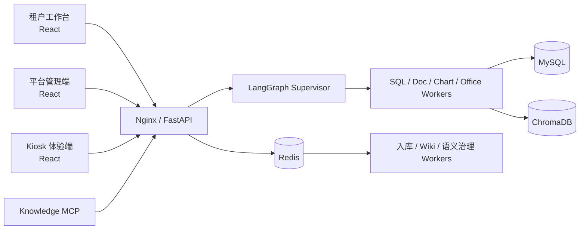

<div align="center">

# DeluData

**让企业数据与知识可以被提问、追溯和治理。**

基于 LangGraph 的多智能体平台，连接自然语言问数、Wiki-First 知识检索、语义治理、Office 产物与线下互动体验。

[功能概览](#功能概览) · [快速开始](#快速开始) · [系统架构](#系统架构) · [开发指南](#开发指南) · [文档](#文档)


</div>

> DeluData 适合需要将结构化数据库、企业文档与权限治理放在同一工作流中的团队。仓库同时包含租户工作台、平台管理端和展厅 Kiosk 体验端。

## 功能概览

| 能力 | 说明 |
| --- | --- |
| 自然语言问数 | LangGraph Supervisor 编排 SQL、文档、图表和 Office Worker；查询执行采用只读校验与工作区数据范围控制。 |
| 语义与权限治理 | 管理业务术语、语义模型、SQL 示例、访问策略和权限证据，支持候选审核与治理任务。 |
| 知识库与 Wiki | PDF、Word、Excel 等文档入库；混合检索、重排、OCR、多模态页面索引和 Wiki-First 路由。 |
| 交付可用产物 | 根据问答与查询结果生成图表、HTML、Word、Excel，支持模板填充。 |
| 多租户管理 | 工作区隔离、角色权限、数据源白名单、平台管理与功能开关。 |
| 线下互动 | 设备激活、语音问答、科普答题、奖励和博物馆导览。 |
| 知识 MCP | 向外部 Agent 提供文档上传、任务查询、证据检索与问答工具。 |

## 快速开始

### 1. 准备配置

需要 Docker Compose；手动开发则需 Python 3.10+、Node.js 20+、MySQL 8 和 Redis 7。

```bash
git clone https://github.com/TT-20011031/DeluData.git
cd DeluData
cp backend/.env.example backend/.env
```

编辑 `backend/.env`，至少填写 `DASHSCOPE_API_KEY`、`APP_SECRET_KEY`、`DB_ENCRYPTION_KEY` 等实际配置。生产部署还应通过环境变量设置数据库密码，关闭调试配置，并妥善保存加密密钥。`backend/.env` 已被 Git 忽略。

### 2. 启动服务

```bash
docker compose up -d --build
docker compose ps
```

| 入口 | 地址 |
| --- | --- |
| 租户工作台 | [http://localhost:8031](http://localhost:8031) |
| 平台管理端 | [http://localhost:8032/platform/](http://localhost:8032/platform/) |
| 展厅体验端 | [http://localhost:8030](http://localhost:8030) |
| Admin API 健康检查 | [http://localhost:8031/health](http://localhost:8031/health) |
| Experience API 健康检查 | [http://localhost:8030/health](http://localhost:8030/health) |

首次启动需要拉取镜像、安装依赖并构建三个前端，耗时取决于网络和机器性能。数据库迁移及已有数据升级请参考 [`backend/migrations/`](backend/migrations/) 中对应脚本与 [部署文档](docs/docker-deployment.md)。

### 3. 本地开发

后端各进程在独立终端运行；先确保 MySQL、Redis 可用，并将 `backend/.env` 中的连接信息指向开发环境。

```bash
cd backend
python -m venv .venv
# Windows: .venv\Scripts\activate
# macOS / Linux: source .venv/bin/activate
pip install -r requirements.txt
uvicorn app.entrypoints.admin_main:app --reload --port 8000
```

体验端 API、文档入库和 Wiki 编译可分别运行：

```bash
uvicorn app.entrypoints.experience_main:app --reload --port 8001
python -m app.entrypoints.ingestion_worker
python -m app.entrypoints.wiki_compile_worker
```

三个前端分别在 `frontend/`、`frontend-platform/`、`kiosk-frontend/` 执行：

```bash
npm ci
npm run dev
```

主前端、平台端和 Kiosk 的默认开发端口分别是 `3000`、`5173`、`5174`。Windows 也可使用仓库根目录的 [`start_app.bat`](start_app.bat) 启动开发进程；它会释放这些端口以及 `8000`、`8001`，运行前请确认端口上没有需要保留的服务。

## 系统架构



| 路径 | 职责 |
| --- | --- |
| `backend/app/entrypoints/` | 管理 API、体验 API 和后台进程入口 |
| `backend/app/supervisor/` | LangGraph 状态、路由、规划和执行 |
| `backend/app/agents/`、`backend/app/tools/` | SQL、文档、图表、Office 等能力 |
| `backend/app/core/`、`backend/app/services/` | RAG、数据库、安全及业务服务 |
| `backend/app/mcp/` | 知识 MCP 服务 |
| `frontend/` | 租户工作台 |
| `frontend-platform/` | 平台管理端 |
| `kiosk-frontend/` | 展厅体验端 |
| `deploy/nginx/` | 统一入口与反向代理 |

## 开发指南

按改动范围运行最小有效测试：

```bash
cd backend
pytest tests/ -v

cd ../frontend
npm run test
npm run lint
npm run build
```

平台端与 Kiosk 分别在自己的目录运行 `npm run lint` 和 `npm run build`。SQL、权限、RAG、Office、图表相关改动应运行对应的后端测试。开发约定见 [`AGENTS.md`](AGENTS.md)。

## 文档

- [Docker 部署](docs/docker-deployment.md)
- [知识库与 Wiki-First 治理](docs/m3-wiki-first-summary.md)
- [语义信任基础](docs/semantic-trust-foundation.md)
- [多模态 PDF RAG](docs/pdf-multimodal-rag-implementation-plan.md)
- [科普体验后端](docs/science-experience-backend.md)
- [Knowledge MCP 使用说明](backend/app/mcp/README.md)

## 安全提示

示例配置和启动脚本面向本地开发。对外部署前，请更换所有默认口令和密钥，限制数据库与 MCP 访问范围，并通过 HTTPS 暴露服务。SQL 只读限制、工作区隔离和权限策略的实现位于后端安全与服务模块；部署时仍需为数据库账号配置最小权限。
