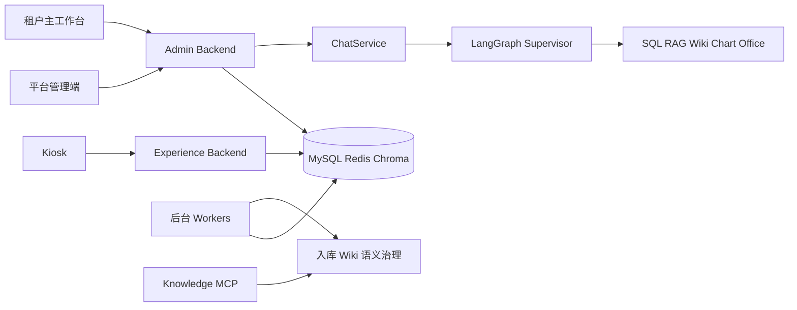

# DeluData：系统架构与模块边界

返回：[[DeluData-项目知识索引]]

## 总体架构

DeluData 采用前后端分离和多进程部署。三个产品前端对应不同身份和场景；两个 FastAPI 进程隔离管理端与访客端；耗时任务交给独立 Worker；MySQL、Redis、Chroma 和文件存储构成共享基础设施。

## 顶层目录

- `backend/`：API、Supervisor、Worker、RAG、SQL、Office、Wiki、语义治理、权限和模型。
- `frontend/`：租户工作台，包含聊天、知识库、数据库、语义治理、授权、模板和扩展场景。
- `frontend-platform/`：平台管理员管理租户、平台管理员、治理和数据库白名单。
- `kiosk-frontend/`：设备激活、访客画像、语音问答、答题和奖励。
- `deploy/nginx/`：统一入口和长连接代理。
- `docs/`：Wiki、RAG、语义治理、Kiosk 与部署设计。

## 进程边界

### Admin Backend

入口 `backend/app/entrypoints/admin_main.py`。负责普通登录用户与平台管理员 API，包括认证、聊天、知识库、数据库、组织、授权、文件、Wiki、语义治理和沙箱产物。

### Experience Backend

入口 `backend/app/entrypoints/experience_main.py`。只组合 `/api/experience`，面向设备与访客，避免把管理 API 暴露到展厅进程。

### 公共生命周期

`entrypoints/common.py` 负责环境变量、日志、数据库、CORS、代理头、静态文件、全局异常、OCR 进程池和关闭清理。Admin 模式启动摘要与沙箱清理；Experience 模式跳过无关后台任务。

### 后台 Worker

- Ingestion Worker：解析、OCR、分块、向量化。
- Wiki Compile Worker ×2：通过数据库锁与 Run Token 并发编译不同任务。
- Semantic Governance Worker：领取治理 Run、维护 Lease/Heartbeat、恢复超时任务。
- Knowledge MCP：向外部 Agent 提供上传、任务状态和 RAG 检索。

## 后端内部层次

- `api/`：HTTP 契约、校验、鉴权和依赖注入。
- `services/`：聊天、入库、Wiki、语义治理、授权等业务用例。
- `supervisor/`：LangGraph State、Nodes、Edges。
- `agents/`：SQL 和 Office 等复杂 Worker。
- `tools/`：Supervisor 调用的稳定接口。
- `skills/`：Schema、SQL、文档、Python、析言等底层能力。
- `core/`：数据库、LLM/VLM、RAG、安全、存储与公共工具。
- `models/`：SQLAlchemy/Pydantic 模型。
- `experience/`：设备鉴权与访客体验服务。

## 数据与状态

- MySQL：租户配置、权限、业务模型、Checkpoint、治理任务和体验数据。
- Redis：缓存、队列和部分多模态能力。
- ChromaDB：文档向量索引。
- 文件/沙箱：上传文件、生成产物和静态资源。
- `memory_dfs`：跨步骤、跨轮次传递的已提交 DataFrame。
- `pending_artifacts`：本轮执行中的结构化临时结果。

## 网关端口

- `8030` → Kiosk 前端与 Experience API。
- `8031` → 主工作台、Admin API、`/platform/` 与 Knowledge MCP。
- `8032` → 独立平台管理入口，同时代理 Admin API 与 MCP。

## 边界判断方法

1. 先判断功能属于租户管理、平台管理还是访客体验。
2. API 只做鉴权、校验、序列化与 Service 调用。
3. 长耗时、可重试任务放入独立 Worker。
4. 能力通过 Tool/Skill 暴露给 Supervisor。
5. 跨模块数据必须有明确持久化位置和生命周期。

相关：[[DeluData-03-LangGraph-Supervisor执行方法]]、[[DeluData-08-构建部署测试与维护]]
