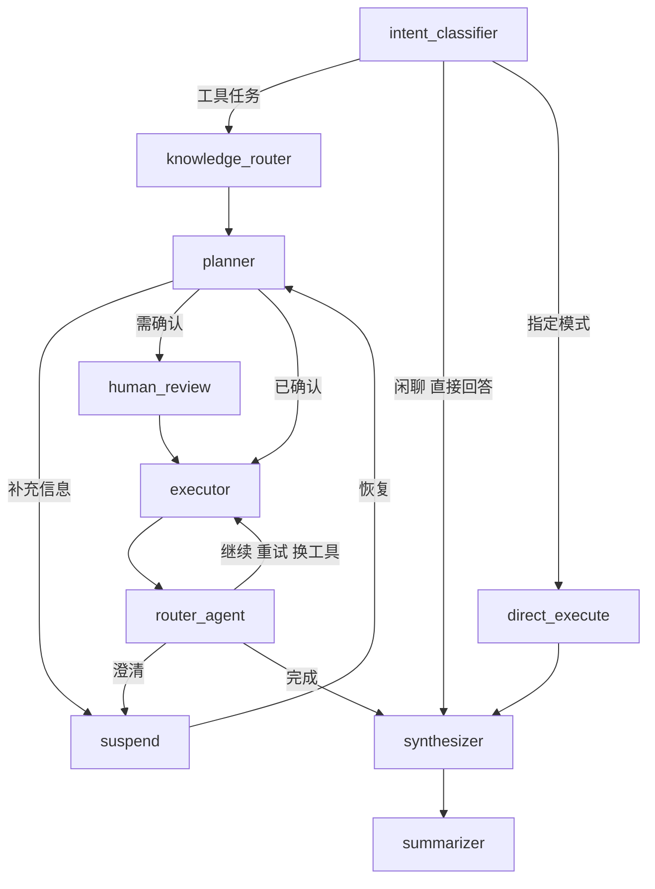

# DeluData：LangGraph Supervisor 执行方法

返回：[[DeluData-项目知识索引]]

## 设计目的

Supervisor 把自然语言请求变成可恢复、可观察、可重试的执行过程。它不实现 SQL 或 RAG，而是管理意图、计划、Worker 调用、质量判断、人工确认、流式事件和最终回答。

## 入口链路

```text
POST /api/chat/start
  → ChatService.start_new_session
  → 恢复 MySQL Checkpoint
  → 加载权限、readiness、用户 Agent 配置和 DeluSkill
  → graph.ainvoke(initial_state)
```

`ChatService` 是 HTTP 与图状态之间的门面。确认、恢复、历史查询和事件发布也由 Service 协调。

## 状态机



## 节点职责

- Intent Classifier：区分闲聊、直接回答、工具任务和直连模式。
- Knowledge Router：决定 `wiki`、`rag` 或 `both`，并记录决策来源。
- Planner：结合历史、DataFrame、文件、readiness、Skill 和权限生成 TaskStep。
- Human Review：复杂计划在执行前等待确认。
- Suspend：执行中缺信息时挂起；恢复后回 Planner 或 Executor。
- Executor：按门控调用工具，注入 Doc Scope，控制重试、步骤数、模板权限和状态。
- Router Agent：输出 `continue`、`retry_self`、`switch_worker`、`ask_clarify` 或 `finish`。
- Synthesizer：汇总证据与引用，执行终结任务，流式回答并提交 Artifact。
- Summarizer：保存长期摘要，清理过旧 DataFrame 和多模态资产。

## Worker 分类

| 分类 | Worker | 作用 |
|---|---|---|
| Extraction | `sql_worker`、`doc_worker`、`inspect_file` | 获取或检查数据 |
| Terminal | `chart_worker`、`office_worker` | 消费数据生成最终产物 |
| Utility | `finish` | 结束流程 |

Tool Registry 将 Worker 名称映射为稳定工具。新增 Worker 时同步修改注册表、分类、Prompt、Executor、前端展示和测试。

## 关键状态

- `session_id`、`plan_id`、`round_index`：会话关联。
- `task_plan`、`plan_status`：计划生命周期。
- `memory_dfs`：已提交的跨轮结构化数据。
- `pending_artifacts`：当前轮临时结果。
- `execution_results`：供 Synthesizer 消费的执行记录。
- `latest_quality_signal`、`route_action`：Worker 自主闭环。
- `interrupt_signal`：Inline HITL。
- `knowledge_path`、`wiki_gap_signal`：Wiki-First 和治理反馈。
- `thought_nodes`、`reasoning_traces`：刷新后可恢复的安全思考展示。

## 直连模式

支持 `rag_only`、`sql_only`、`chart_only`、`office_only`。直连仍检查权限、readiness 和输入数据。没有数据库查询能力的 `sql_only` 会转为 `sql_plan`，由 Planner 处理安全流程。

## SSE 事件

- 正文：`message_start`、`message_chunk`、`message_end`。
- 计划：`plan_update`、`step_update`、`plan_complete`。
- 思考：`thinking_log`、`ai_thought`、`reasoning_chunk`、`reasoning_end`。
- 交互与产物：`interrupt`、`chart_status`、`artifact`、`file_result`。
- 错误：`error`。

## 修改检查清单

- State 字段 Reducer 是否正确？
- Node 返回是否符合 State 契约？
- Edge 是否覆盖错误、空计划、中断、重试和结束？
- Checkpoint 恢复后是否重复执行或重复发事件？
- session、plan、round、step ID 是否一致？
- `memory_dfs` 是否在正确阶段提交和清理？
- 前端刷新后能否恢复计划、思考和产物？

相关：[[DeluData-04-Text-to-SQL与可信语义治理]]、[[DeluData-05-RAG-Wiki-First与知识治理]]
